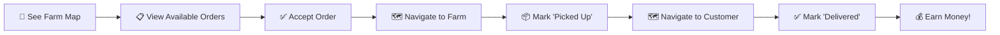

# 🚀 Latest Updates - Produce Perfect App

## ✅ **ISSUES FIXED:**

### 1. **Cart Permission Error Fixed**
- **Problem**: Cart was showing permission denied error
- **Solution**: Added missing cart collection rules to Firebase
- **Action Required**: Update your Firestore rules with the new cart permissions from `FIRESTORE_RULES.md`

### 2. **Consumer Navigation Fixed**
- **Problem**: Profile and Orders tabs were in wrong positions and identical
- **Solution**: 
  - ✅ Moved Profile to rightmost position
  - ✅ Moved Orders to 3rd position (left of Profile)
  - ✅ Created dedicated `ConsumerOrdersScreen` showing order history, payment amounts, and delivery times

### 3. **Mandatory Address Fields Added**
- **Problem**: Distance calculation needed mandatory addresses
- **Solution**: 
  - ✅ Added address picker to Consumer signup
  - ✅ Added address picker to Farmer signup (already completed)
  - ✅ Address validation prevents signup without location

### 4. **Rider Screen Completely Redesigned**
- **Problem**: Pointless toggle, no maps, no tracking workflow
- **Solution**: 
  - ✅ **Removed** available orders toggle
  - ✅ **Added** Google Maps showing farm locations with green markers
  - ✅ **Added** real-time farm spots showing products for sale
  - ✅ **Added** complete order tracking workflow:
    - Accept Order → Navigate to Farm → Mark "Picked Up" → Navigate to Customer → Mark "Delivered"
  - ✅ **Added** earnings display when order is completed

## 🗺️ **NEW RIDER WORKFLOW:**



## 🔥 **FIREBASE SETUP REQUIRED:**

### **Update Firestore Rules** (CRITICAL):
Copy the updated rules from `FIRESTORE_RULES.md` to your Firebase Console. The new rules include cart permissions:

```javascript
// Carts collection - users can only access their own cart
match /carts/{userId} {
  allow read, write, create, update, delete: if request.auth != null && request.auth.uid == userId;
}
```

### **Firebase Indexes Already Created** ✅
All necessary indexes should already be in place from previous setup.

## 📱 **TESTING CHECKLIST:**

### **Customer Flow:**
- [ ] Sign up requires delivery address
- [ ] Cart loads without permission errors
- [ ] Orders tab shows order history with payments and delivery times
- [ ] Profile tab is on the right

### **Rider Flow:**
- [ ] See map with green farm markers
- [ ] Click farm markers to see available products
- [ ] View available orders list below map
- [ ] Accept order → get navigation to farm
- [ ] Mark "Picked Up" → get navigation to customer  
- [ ] Mark "Delivered" → see earnings notification

### **Farmer Flow:**
- [ ] Sign up requires farm address
- [ ] Create posts work without errors
- [ ] Profile loads successfully

## 🎯 **KEY FEATURES WORKING:**

✅ **Real-time Order Updates**: Orders appear instantly on rider screens  
✅ **Google Maps Integration**: Turn-by-turn navigation for riders  
✅ **Distance-based Pricing**: Automatic delivery fee calculation  
✅ **Order Status Tracking**: Complete lifecycle from pending to delivered  
✅ **Mandatory Addresses**: All users must provide valid locations  
✅ **Farm Location Maps**: Visual representation of farms with products  

## 🚀 **NEXT STEPS:**

1. **Update Firebase Rules** using `FIRESTORE_RULES.md`
2. **Test the complete workflow** end-to-end
3. **Create some test data**:
   - Farmer account with farm location
   - Customer account with delivery address
   - Rider account to accept orders

**Your app now has a complete real-time marketplace with Google Maps integration! 🌟**
